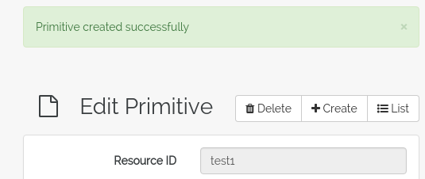
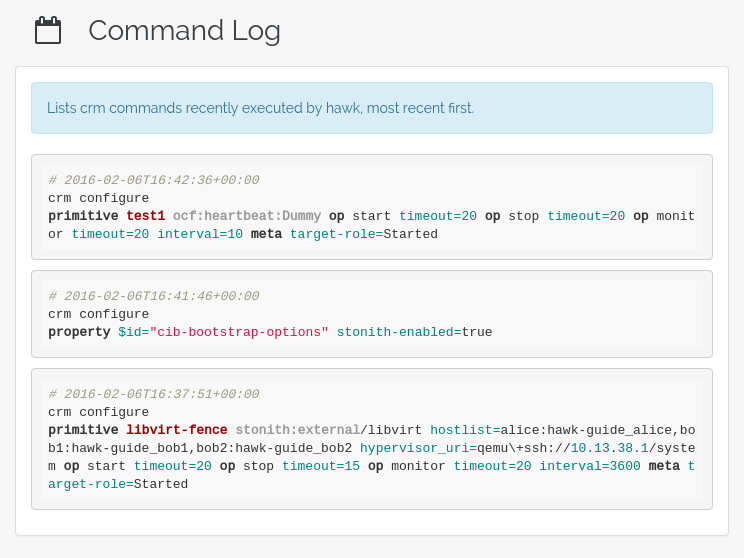
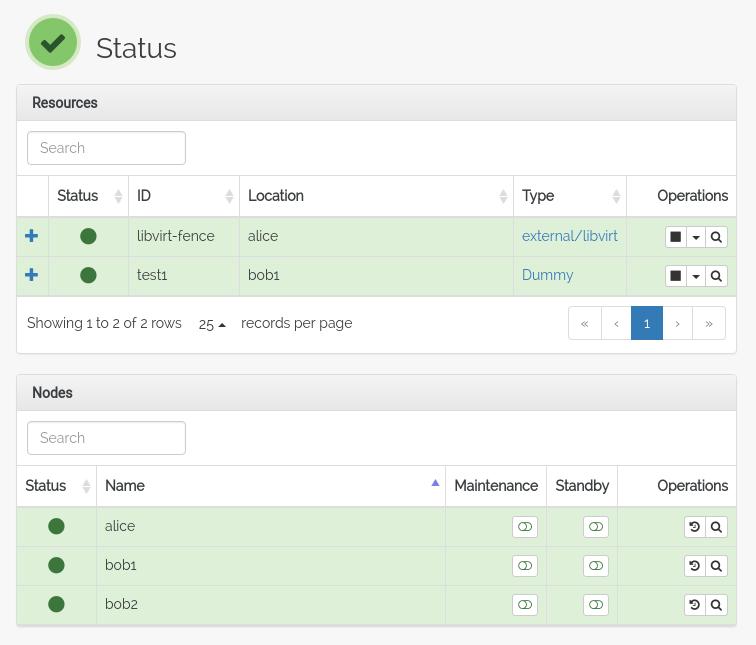
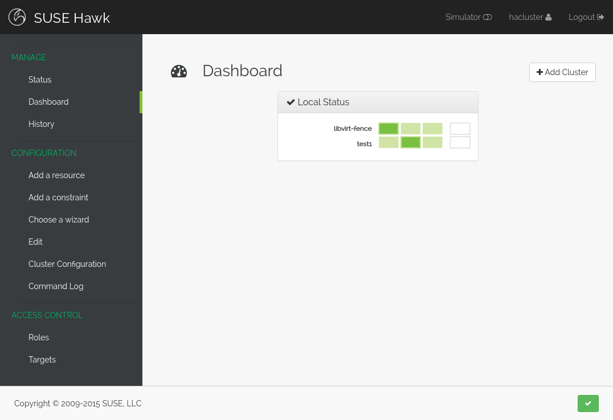
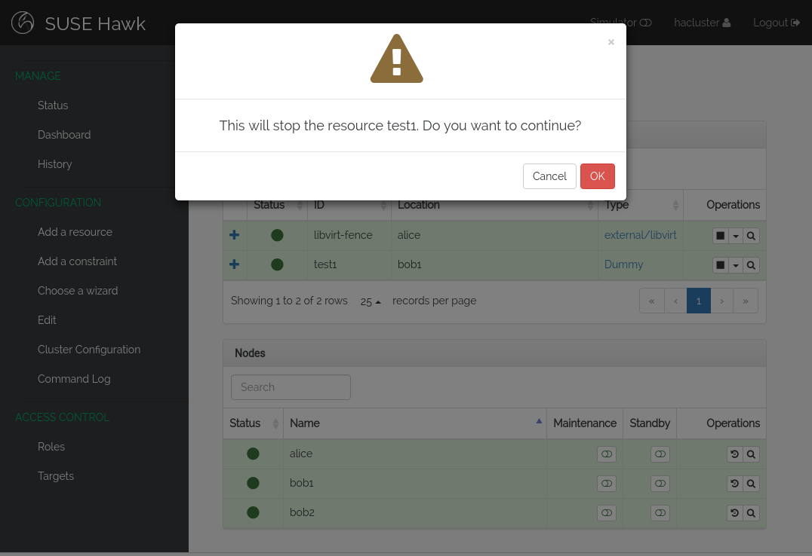
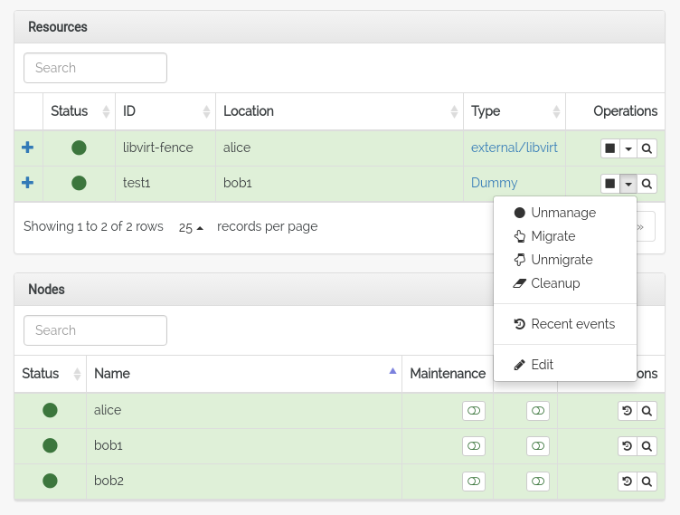
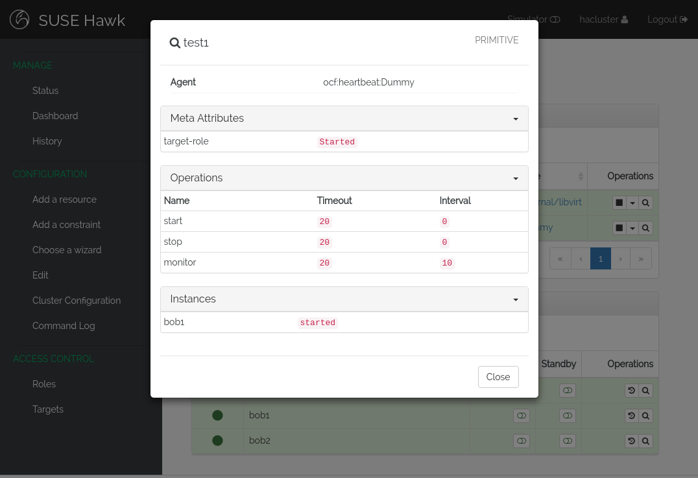
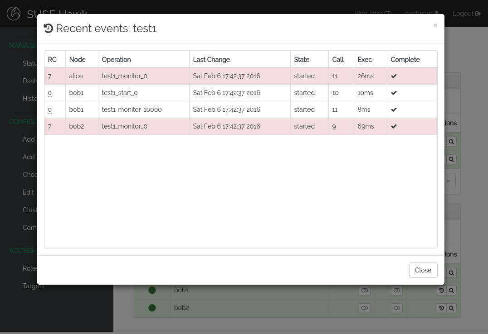

Creating a Resource
===================

To learn how to control resources in the cluster without having to
worry about an actual application, we can use the aptly named
``Dummy`` resource agent. In this section of the guide, we will create
a new dummy resource and look at the status and dashboard views of
Hawk, to see how we can start and stop the resource, reconfigure
parameters and monitor its location and status.

Add a resource
--------------

To add a resource, click *Add Resource* in the sidebar on the
left. This brings up a list of different types of resources we can
create. All basic resources that map to a resource agent or service
are called *Primitive resources*. Click the **Primitive** button on
this screen.

1. Name the resource ``test1``. No need to complicate things.

2. From the **Class** selection box, pick ``ocf``. The **Provider**
   selection box will default to ``heartbeat``. This is what we want
   in this case. Other resource agents may have different providers.

3. From the **Type** selection box, select ``Dummy``. To learn more
   about the Dummy resource agent and its parameters, you can click
   the blue *i* button below the selection boxes. This brings up a
   modal dialog describing the selected agent.

   .. image:: _static/resource-type.png
              :align: center

Parameters
^^^^^^^^^^

The Dummy agent does not require any parameters, but it does have two:
``fake`` and ``state``. In the selection box under *Parameters* it is
possible to select either one of these, and by clicking the plus next
to the selection box, the parameter can be configured with a value.

On the right-hand side of the screen, documentation for the parameter
is shown when highlighted.

For now, there is no need to set any value here. To remove a
parameter, click the minus button next to it.

Operations
^^^^^^^^^^

In order for Pacemaker to monitor the state of the resource, a
``monitor`` operation can be configured. Resources can have multiple
operations, and each operation can be configured with parameters such
as timeout and interval. Hawk has configured some reasonable default
operations, but in many cases you will need to modify the timeout or
interval of your resource.

If no ``monitor`` operation is configured, Pacemaker won't check to
see if the application it maps to is still running. Most resources
should have a ``monitor`` operation.

Meta Attributes
^^^^^^^^^^^^^^^

Meta attributes are parameters common to all resources. The most
commonly seen attribute is the ``target-role`` attribute, which
tells Pacemaker what state the resource ought to be in. To have
Pacemaker start the resource, the ``target-role`` attribute should be
set to ``Started``. By default, Hawk sets this attribute to
``Stopped``, so that any necessary constraints or other dependencies
can be applied before trying to start it.

In this case, there are no dependencies, so set the value of this
attribute to ``Started``.

Utilization
^^^^^^^^^^^

Utilization can be used to balance resources across different
nodes. Perhaps one of the nodes has more RAM or disk space than the
others, or perhaps there is a limit on how many resources can run on a
given node. The utilization values can be used to manage this. By
configuring utilization limits on the nodes themselves and configuring
utilization values on the resources, resources can be balanced across
the cluster according to the properties of nodes.

Finishing Up
^^^^^^^^^^^^

To complete the configuration of this dummy resource, click
Create. Hawk will post a notification showing if it completed the
operation successfully or not.

Command Log
^^^^^^^^^^^

To see the command used to create the resource, go to the *Command
Log* in the sidebar to the left of the screen. Here you can see a list
of ``crm`` commands executed by Hawk, with the most recent command
listed first.

Status and Dashboard
--------------------

The created resource ``test1`` will appear as a green line in the Hawk
status view. Stopped resources are colored white, while failed
resources are red.

The Dashboard view gives an alternative view of the cluster status. In
this view, the cluster is represented by a matrix of lights indicating
the state of the resource on each node.

Each row is a resource, and each column is a node. The rightmost
column holds resources that are stopped and therefore not running on
any node.

Starting and Stopping
^^^^^^^^^^^^^^^^^^^^^

Resources can be started and stopped directly from the status
view. Use the control icons to the right of the resource listing. When
stopping a resource, Hawk will ask for verification before applying
the change.

Try stopping and starting the resource. Open the Dashboard in another
browser window and see how it updates when the resource is stopped or
started.

Migrating Resources
^^^^^^^^^^^^^^^^^^^

Clicking the down arrow icon next to a resource opens the extended
operation menu. From this menu you can choose from a list of more
advanced resource operations.

Migrating a resource means moving it away from its current
location. This is done with the help of a location constraint created
by the user interface. Migration can be given a destination node as an
argument, or if no node is provided, the resource is migrated to any
other node.

To create such a migration constraint, use the *Migrate* action in the
resource menu.

Once the resource has been migrated, the constraint can be
removed. This is done using the *Unmigrate* action. Note, however,
that once the constraint is removed, Pacemaker may decide to move the
resource back to its original location. To prevent this from
happening, set the ``resource-stickiness`` cluster property.

Details
^^^^^^^

The Details view is accessed via the looking glass button for a
resource. This view shows the resource configuration and other
details, plus a list of instances.

Recent Events
^^^^^^^^^^^^^

The Recent Events pane shows a list of actions taken by Pacemaker
related to the resource. Each action has a return code, the meaning of
which is explained by the tooltip which shows when hovering the mouse
over the code. For example ``0`` means success, while ``7`` means that
the resource was not running.

In the example view, you can see multiple red lines indicating that
the resource action failed. These are not actual failures. Pacemaker
runs monitor actions for resources on **all** nodes in the cluster, to
make sure that the resource is not running where it shouldn't
be. These probes show up as failed actions in the Recent Event view,
but they are in fact expected to fail.

It is possible to disable these probes for a resource using the
*Resource Discovery* attribute on a location constraint. This,
however, is generally not a good idea and is only needed for some
specific advanced configurations.

Editing resources
-----------------

The Edit view for a resource can be found either through the operation
menu on the status view, or through the *Edit* screen accessible from
the sidebar on the left.

Once in the edit view, you can change any parameters or attributes for
the resource, or even delete it.

Note that it is not yet possible to change the resource type of an
existing resource in Hawk.

Renaming
^^^^^^^^

To rename a resource, go to the *Edit Configuration* screen, and use
the *Rename* operation for the resource.

Only stopped resources may be renamed.
