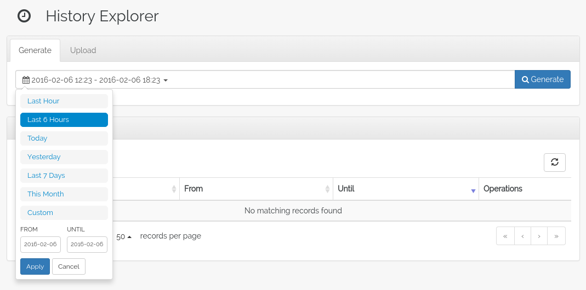
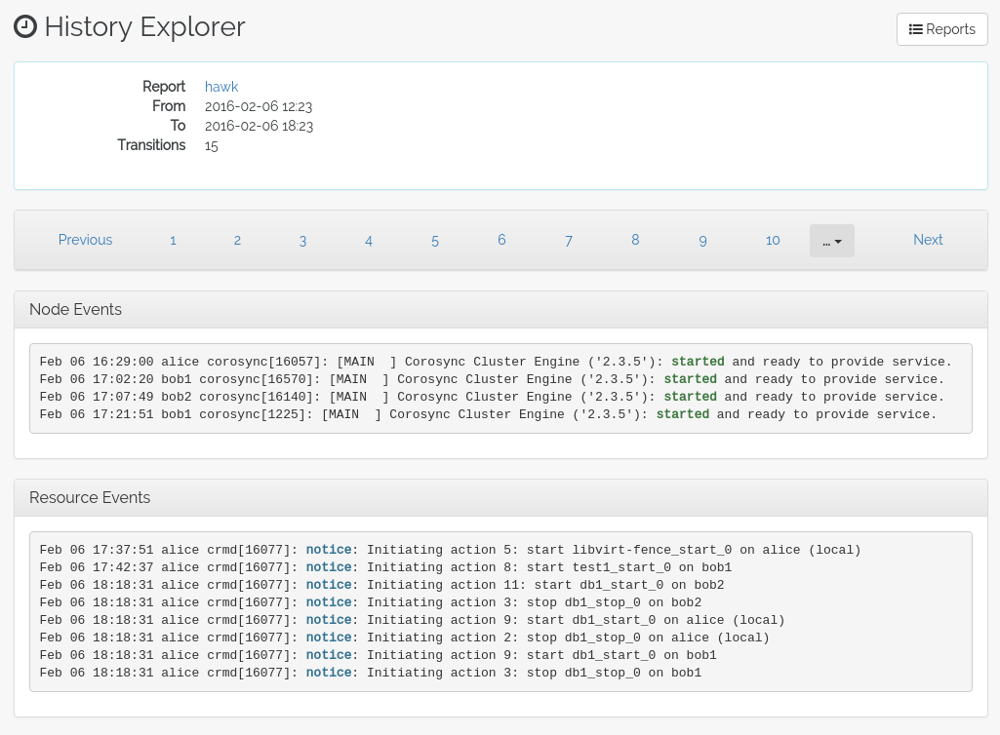

History Explorer
================

TODO: Describe the history explorer, example usage.

The history explorer is a tool for collecting and downloading cluster
reports, which include logs and other information for a certain
timeframe. The history explorer is also useful for analysing such
cluster reports. You can either upload a previously generated cluster
report for analysis, or generate one on the fly.

Once uploaded, you can scroll through all of the cluster events that
took place in the time frame covered by the report. For each event,
you can see the current cluster configuration, logs from all cluster
nodes and a transition graph showing exactly what happened and why.

Create / Upload
---------------

From the *History Explorer* pane, it is possible to create new history
reports and upload a previously created report. A list of all created
reports appear below, which options to view or download each report.

Viewing a Report
----------------

When viewing a report, the interface presents a list of *Transitions*
that occurred during the time frame covered by the report. These
Transitions are changes in the cluster state. Either they are
triggered by changes in the configuration, or something happened like
a resource failure or a node failure, and the cluster reacted to it in
some way.

Below the transition list, there is a list of node and resource
events. The history explorer analyses the given report and tries to
sift out the key events so that finding the interesting section of the
report is made a bit easier.

Video
-----

The embedded video is somewhat outdated, and shows the history
explorer as it looked in Hawk 1. However, it may be a good
introduction to the basic functionality of the history explorer.

.. raw:: html

    

    <iframe width="420" height="315" src="https://www.youtube.com/embed/mngfxzXkFLw" frameborder="0" allowfullscreen></iframe>
    

