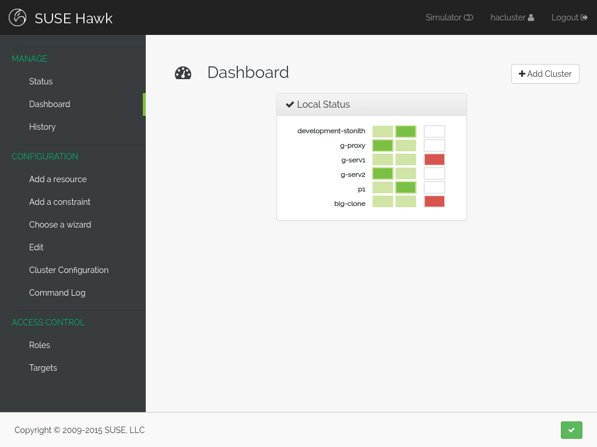

Getting Started using Hawk
==========================

This guide is an introduction to using Hawk, the High Availability
Web Konsole. Hawk is a web interface for the HA Pacemaker stack in
Linux. With Hawk, the management and configuration of HA clusters is
greatly simplified.

Contents:

.. toctree::
   :maxdepth: 2

   installation
   basic-concepts
   stonith
   creating-a-resource
   wizard
   history-explorer
   simulator
   README

Indices and tables
==================

* :ref:`genindex`
* :ref:`search`

