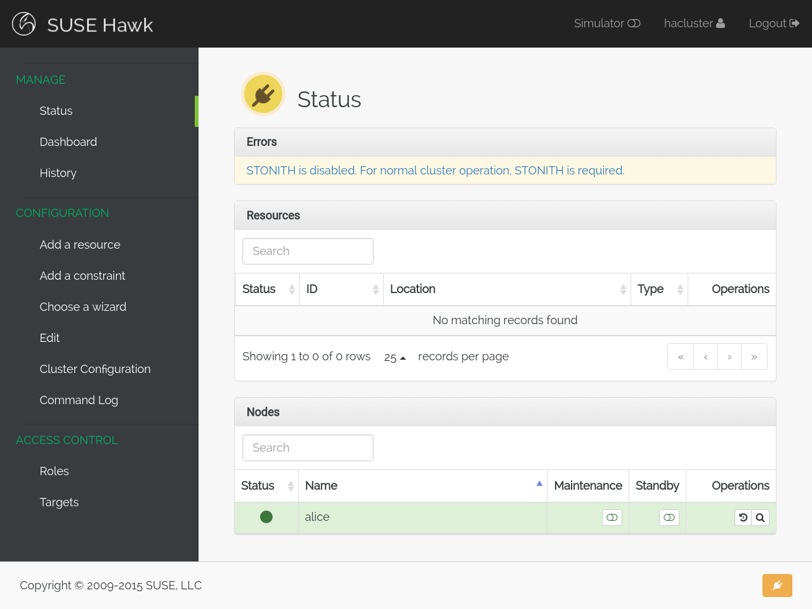

Installation
============

This guide comes with a ``Vagrantfile`` which configures and installs
a basic three-node HA cluster running Pacemaker and Hawk. This is the
cluster that will be used in the rest of this guide.

Make sure that you have a fairly recent version of Vagrant [#vagrant]_
installed together with either VirtualBox or libvirt as the VM
host. To use libvirt, you may need to install the bindfs [#bindfs]_ plugin for
Vagrant. For more details on how to install and use Vagrant, see
https://www.vagrantup.com/ .

To begin setting up the example cluster, use ``git`` to check out a
copy of the source repository for this guide::

  $ git clone --recursive git@github.com:krig/hawk-guide

Now let Vagrant configure a virtual machine [#provider]_ running Hawk::

  $ cd hawk-guide
  $ vagrant up alice

If everything goes as it should, Vagrant will go off and do its thing,
downloading a base VM image and installing all the necessary network
configuration and software packages that we'll need. Once the
installation finishes, a VM running Pacemaker and Hawk should start
up.

The ``Vagrantfile`` can configure three VMs: ``alice``, ``bob1`` and
``bob2``. So far we've only configured ``alice``, but once you have
confirmed that the installation was successful you can also start the
other two VMs using ``vagrant up``::

  $ vagrant up bob1
  $ vagrant up bob2

Make sure Hawk is running by logging into the ``alice`` VM and running
the following commands::

  $ vagrant ssh alice
  (alice) $ sudo chkconfig hawk on
  (alice) $ sudo service hawk start

Logging in
----------

To view the Hawk web interface, open this URL in your
web browser: https://localhost:7630/

Connecting to port ``7630`` on ``localhost`` should work for the above
described installation method, since the ``Vagrantfile`` also forwards
port ``7630`` from the virtual machine. If you installed Hawk on a
different machine than the one you are currently using, you will need
to connect to port ``7630`` on that machine instead.

You may see a prompt warning you about an unverified SSL
certificate. By default, Hawk generates and presents a self-signed
certificate which browsers are understandably sceptical about.

Once you have accepted the certificate, you will be faced with a
username and password prompt. Enter ``hacluster`` as the username and
``linux`` as the password. This is the default identity as configured by
the HA bootstrap script. Naturally, you would want to change this
password before exposing this cluster to the wider world.

A note on fencing
-----------------

After logging in, the Status view of Hawk should appear, looking
something like the image below.

Notice that the status is yellow (meaning warning), and that there is
an error reported::

  STONITH is disabled. For normal cluster operation, STONITH is required.
  
STONITH, or fencing, is an essential element in any production
cluster. When a node stops communicating or gives conflicting
information to its peers, the other nodes need some way to ensure that
the misbehaving node isn't running resources it shouldn't be. Examples
of this kind of failure are network outages or a failed stop action.

The mechanism used by Pacemaker to handle these kinds of failure is
usually referred to as fencing or STONITH [#stonith]_.

Any production cluster needs fencing. However, fencing can be complex
to configure, especially in an automatic fashion. There are fencing
agents available for both libvirt and VirtualBox, and there is also a
form of fencing which relies on shared storage called SBD [#sbd]_.

To learn how to configure an actual fencing device for this cluster
and get rid of that warning, see :doc:`stonith`.

.. rubric:: Footnotes
.. [#vagrant] https://www.vagrantup.com/
.. [#provider] This command lets Vagrant decide which virtualization
               provider to use. To select a provider manually, pass
               ``--provider=libvirt|virtualbox|...`` parameter to
               ``vagrant up``.
.. [#bindfs] https://github.com/gael-ian/vagrant-bindfs
.. [#stonith] Shoot the Other Node in the Head.
.. [#sbd] https://github.com/ClusterLabs/sbd
