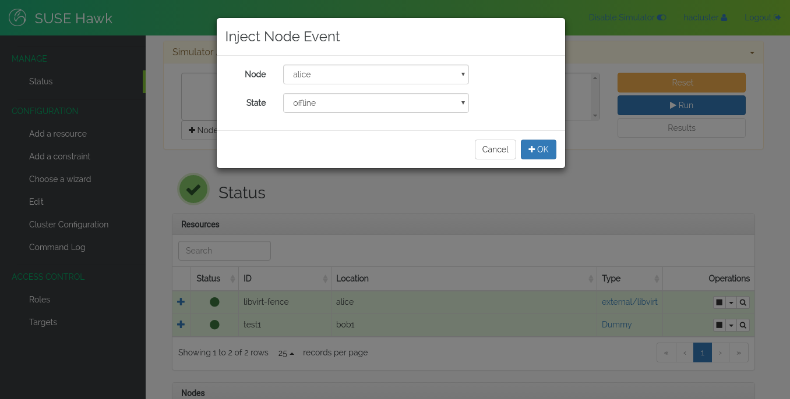

Simulator
=========

TODO: Describe how to use the simulator.

To enable the simulator, use the *Simulator* toggle at the top of the
Hawk screen. This will either enable or disable the simulator.

Once in simulation mode, a panel will appear on each page, and some of
the screens in Hawk will be disabled. While in the simulator, you can
create, delete and edit resources and constraints without actually
applying these changes to the cluster. You can also simulate events in
the cluster, such as node failure or resource failure.

