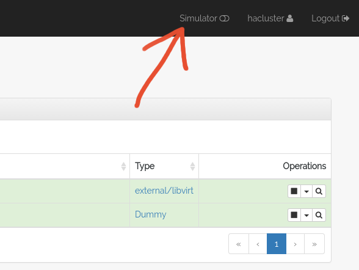
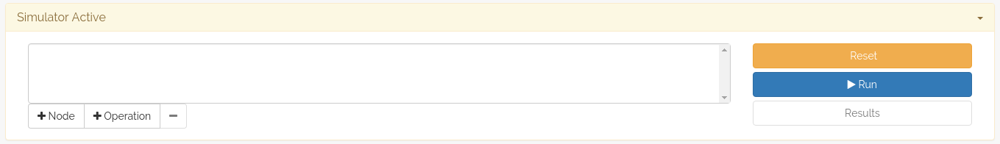
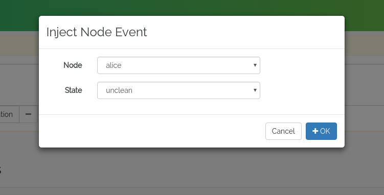
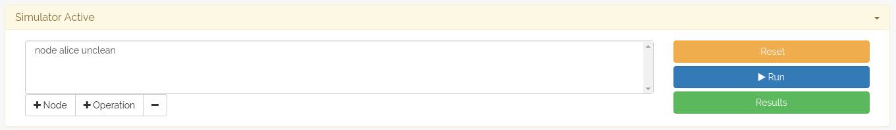
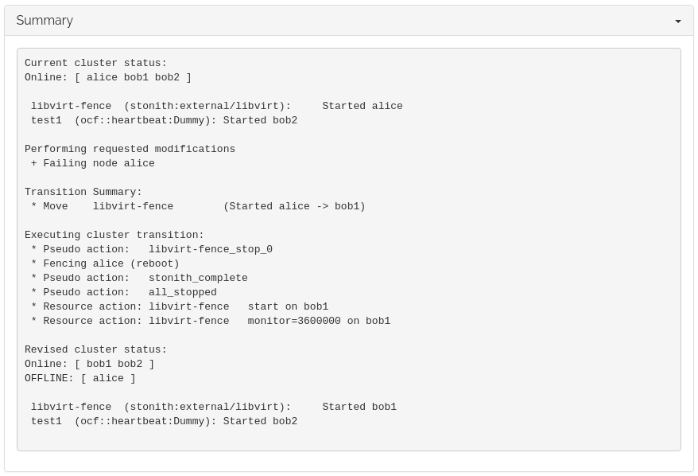
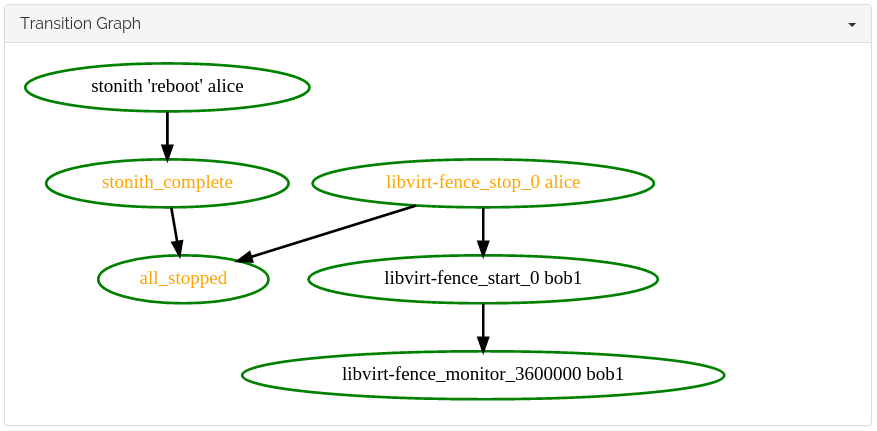

Simulator
=========

The *Simulator* in Hawk can be used to test changes to the cluster
without actually changing the configuration. By enabling the
simulator, resources and constraints can be edited, created or deleted
freely, and the Status view will update instantly with the new
expected state of the cluster. This makes it easy to test complex
resource constraints, for example.

In this section, we will demonstrate that our fencing device works,
first by testing the cluster resource using the Simulator, and second
by actually triggering a fence event.

Fence Cluster Resource
----------------------

In :doc:`stonith` we configured a ``external/libvirt`` resource.

Using the simulator, we can test that the cluster configuration of
this cluster resource is correct without actually triggering a reboot
of any cluster node.

To do this, go to the *Status* view in Hawk and enable the Simulator
using the toggle in the upper right corner of the window.

At the top of the main area of the Hawk application, a new panel
should appear.

To simulate that the node ``alice`` experiences a failure that
requires fencing, inject a *Node Event* using the **+ Node** button in
the Simulator panel. This opens a dialog where you can choose which
node and what event to simulate. In this case, we want to simulate an
``unclean`` event. ``unclean`` is Pacemaker code for a node that is in
need of fencing.

The node event is added to the current simulation queue, in the middle
of the simulator panel. To run the simulator, press the **Run** button
on the right side of the panel.

The **Results** button will turn green, indicating that there are
simulation results available to examine.

In the modal dialog that opens when the **Results** button is clicked,
you can see a summary of the events that the cluster would initiate if
this event occurred.

In this case, we can verify that the cluster would indeed attempt to
fence the node ``alice``, as seen on the second line in the transition
list::

    Executing cluster transition:
     * Pseudo action:   libvirt-fence_stop_0
     * Fencing alice (reboot)
     * Pseudo action:   stonith_complete
     * Pseudo action:   all_stopped
     * Resource action: libvirt-fence   start on bob1
     * Resource action: libvirt-fence   monitor=3600000 on bob1

The graph view can sometimes be confusing if there are a lot of
actions being triggered, but this example serves as a nice
introduction to reading transition graphs.

In the graph, we can see that the cluster reboots ``alice``, and in
parallel restarts the fencing device on another node (since it was
running on ``alice`` before the event).

Exit the simulator using the the **Disable Simulator** toggle at the
top right.

Fence Event
-----------

To trigger a fence event, we use the ``virsh`` command tool on the
hypervisor machine.

Since we are going to make ``alice`` reboot, we should use Hawk from
one of the other nodes. Go to https://localhost:7632/ [#bob2]_ to log
in to ``bob2``. The Hawk interface should look the same as on ``alice``.

As ``root``, run the following command::

  $ virsh suspend hawk-guide_alice

At the same time, keep an eye on the Status view on ``bob2``.

Suspending the VM has the same effect as a network outage would have,
and the only recourse the cluster has is to fence the node which is no
longer responding.

A sequence of events will occur in rapid succession:

1. The ``libvirt-fence`` resource which was running on ``alice`` will
   enter an unknown state (shown with a yellow question mark in the
   Status view).

2. The node ``alice`` may briefly appear to be in an ``unclean``
   state, but will quickly move to ``stopped`` as the fence action
   completes.

3. ``libvirt-fence`` will start on one of the Bobs. It may briefly
   appear to be running both on ``alice`` and on one of the Bobs. Since
   ``alice`` has been fenced, Pacemaker knows that the resource is no
   longer running there. However, it is conservatively waiting until
   ``alice`` reappears before updating the status of the resource.

4. ``alice`` will reboot and turn green again.

Fencing was successful.

.. rubric:: Footnotes
.. [#bob2] We are logging into ``bob2`` here rather than ``bob1``,
           since we triggered a reboot of ``bob1`` while configuring
           fencing which unfortunately disrupted the port forwarding
           that Vagrant configured for us. We can still reach Hawk on
           ``bob1`` by connecting directly to its IP address:
           https://10.13.38.11:7630/
