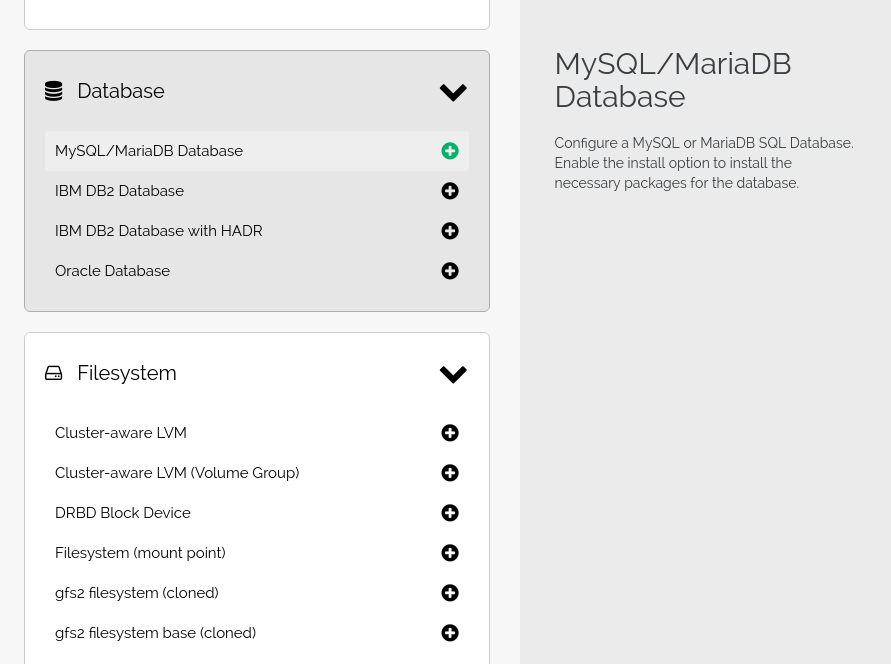
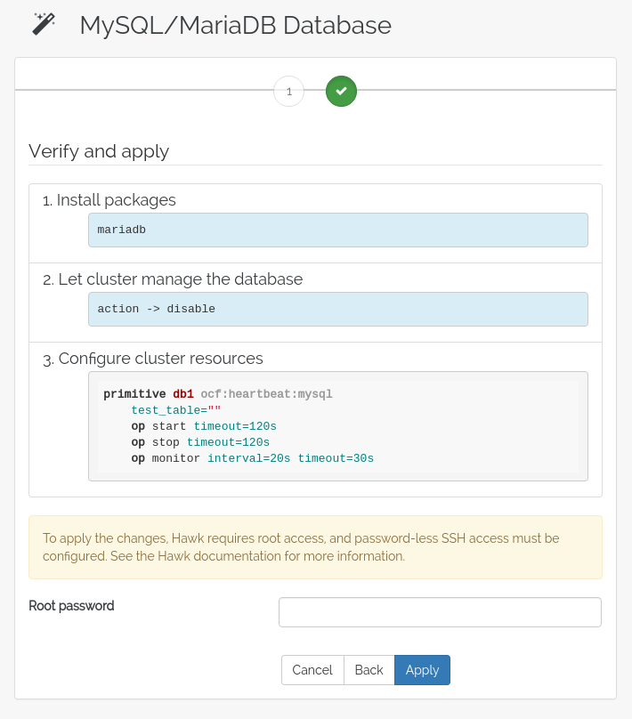

Wizards
=======

A guide to using a wizard to configure cluster resources.

TODO: Expand this into an actual guide using the wizards to configure
real resources.

Select a Wizard
---------------

On the wizard selection screen are a list of categories. In each
category there is a list of wizards, for example the MariaDB wizard in
the Database category.

Each wizard comes with a set of steps, some of which may be
optional. In the end, the wizard will verify any parameters and
present a list of actions that will be performed on the cluster. This
may involve creating new resources or constraints, but also package
installation, configuration and verification.

Setting Parameters
------------------

Each step has a list of parameters to set. Some may have default
values, while others need to be configured. In some cases, the wizard
presupposes the existance of certain resources. For example, the file
system wizards generally require that the file system to be managed by
the cluster already exists.

Some wizard steps may have a lot of possible parameters. These
parameters will be listed in the *Advanced* section. Most of the time,
there should be no need to delve into this section. However, sometimes
it can be useful to be able to change a more obscure parameter of a
wizard.

Optional Steps
--------------

Some wizards have optional steps, for example configuring a virtual IP
that can be used together with a resource. These can be skipped, and
whatever actions they would perform will be left out.

Verify and Apply
----------------

Once all the parameters for a wizard have been filled out, the wizard
can be applied. If the wizard needs root access on the cluster nodes,
for example if it needs to install any packages, the wizard will
prompt for the root password here.

Applying the wizard may take a while. Once it completes, a
notification will indicate if the wizard was successful.
